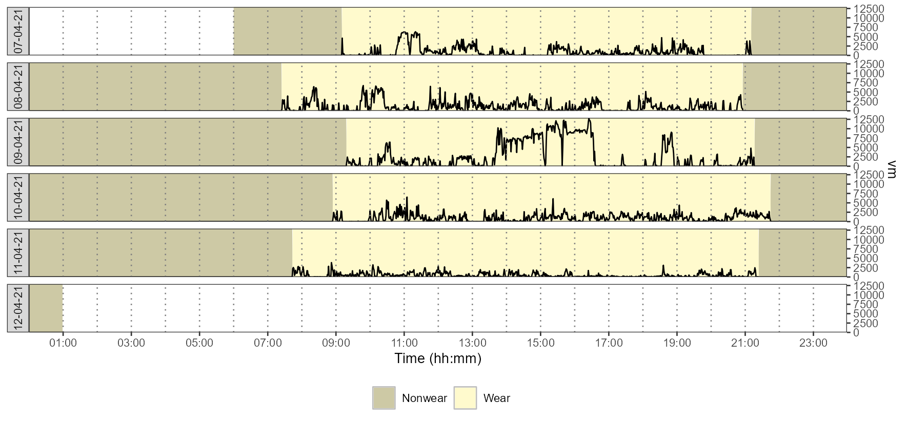
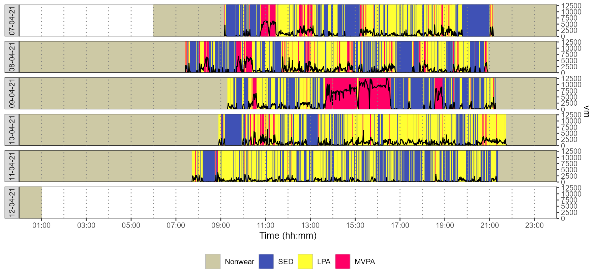
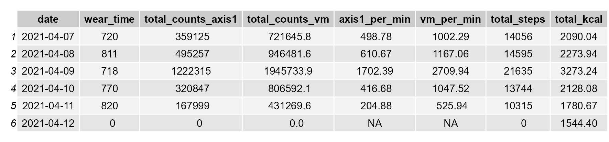
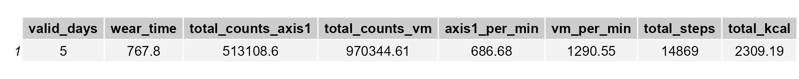

# Summary
Physical activity is a behaviour related to many health outcomes [@whoWHOGuidelinesPhysical2020]. Accelerometry has become a method to be prefered to questionnaires when available to measure physical activity, at least because: (i) it allows avoiding psychosocial bias related to questionnaire use (e.g., recall bias) [@ainsworthCurrentStatePhysical2015]; (ii) it allows capturing all activities, while questionnaires capture physical activity of moderate-to-vigorous intensity only [@ekelundPhysicalActivityMortality2020]; (iii) accelerometry is a more valid method than questionnaires to estimate total energy expenditure [@hallalEnergyExpenditureCompared2013; @colbertComparativeValidityPhysical2011;@gardnerAssessmentFreelivingDaily1998]; (iv) and accelerometry is now a way to access a diversity of metrics that cannot be obtained using questionnaires [@keadleEvaluationAccelerometerderivedMetrics2017; @backesAdvancedAnalyticalMethods2022].

ActiGraph devices (ActiGraph LLC, Pensacola, FL) have been the most used accelerometers in scientific literature [@bassettAccelerometerbasedPhysicalActivity2015a; @miguelesAccelerometerDataCollection2017]. These devices, along with their software companion ActiLife (ActiGraph LLC, Pensacola, FL), allow to get movement data expressed in either *activity counts* or *G-force* units. Activity counts represent the amount of acceleration produced over a given epoch of time at the wearing position of the device. While analytic methods based on G-force data are developping, using activity counts to assess physical activity and sedentary behaviours remains common [@miguelesAccelerometerDataCollection2017].

If the protocol for measuring physical activity itself may be relatively simple to implement for a given individual, the way to get the final results of the assessment is not straightforward. Indeed, several steps of data analysis must be completed, with one or several choices to be made at each step. These steps and choices could be described as follows [@heilModelingPhysicalActivity2012]:

* Controlling quality of data: the choices to be made concern the threshold value (e.g., in counts/min) above wich data should be flagged as abnormal, and also concern the algorithm to be implemented to detect and quantify nonwear time; 
* Controlling quantity of data that can be used for characterizing physical behaviour: the choices to be made concern the minimum of wear time to be obtained in a day to consider a day as valid, and the choices also concern the minimum number of valid days to be obtained to consider the whole measurement as valid;
* Converting activity counts into physiological meaningful units: the choices to be made concern the most appropriate algorithm to characterize the nature and/or the intensity of the activity performed at each epoch, such as an algorithm for classifying intensity of activity as sedentary, light, moderate, or vigorous for each epoch;
* Summarising data using metrics of interest: the choices to be made concern the most appropriate method to get the most appropriate metric depending on the objective of the measurement (e.g., physical activity volume, time spent in different intensities of physical activity).

Beyond these general steps, additional steps may be required to get the final results in some research or clinical frameworks that use accelerometer data. A good example is the framework related to the use of the PROactive Physical Activity in COPD (chronic obstructive pulmonary disease) instruments [@dobbelsPROactiveInnovativeConceptual2014; @gimeno-santosPROactiveInstrumentsMeasure2015; @garcia-aymerichValidityResponsivenessDaily2021]. Such a framework requires to combine scores related to answers to questionnaire items and scores related to accelerometer metrics (i.e., daily mean vector magnitude and daily total steps count) obtained from a week of measurement, and ActiGraph devices are among the accelerometers that can be used to implement this framework in COPD patients.

In view of the interest of using accelerometry to measure physical activity, in particular using activity counts from ActiGraph accelerometers, there is a need to train students, future healthcare providers, and clinicians, to implement this method, and there is also a need to have the possibility to use a simple data analysis procedure to favor the implementation of this method routinely in clinical settings or when required in research settings.

# A need of a simple app to analyse ActiGraph accelerometer counts and to get the PROactive instruments results
Due to the large size of data files to analyse when using accelerometry and due to the relative complexity of the implementation of some algorithms (e.g., to detect nonwear time), a simple spreadsheet does not appear to be a feasible tool to complete all the accelerometer data analysis workflow from the same place. The 'Full' version of ActiLife software allows completing all the general steps of the data analysis workflow described above with activity counts but the cost of this ActiLife version may prevent teaching a wide audience to implement such a workflow and may also prevent working with large teams on recorded data ('Lite' versions of ActiLife software, that are at a lower cost than 'Full' versions, allow device initialisation and data downloading only). Moreover, there is no solution in ActiLife software to fully implement the PROactive framework for COPD patients described above.

Other ways than ActiLife software to analyse activity counts include using programming languages. R [@rcoreteamLanguageEnvironmentStatistical2022] and Python [@pythonsoftwarefoundationPython2022] have been programming languages commonly used by scientists to build tools aiming at fostering physical activity data analysis. In R, the 'accelerometry' and 'nhanesaccel' packages by Van Domelen and Pittard [-@vandomelenFlexibleFunctionsProcessing2014], the 'actigraph.sleepr' package by Petkova [-@petkovaActigraphSleeprDetect2021], and the 'pawacc' package by Geraci [-@geraciPawaccPhysicalActivity2017], provide several functions to perform analyses of interest with activity counts. In Python, the 'pyActigraphy' library by Hammad and Reyt [-@hammadPyActigraphy2020] also allows, among various other features, to handle ActiGraph activity counts. While useful for research settings, these ressources may be of a little interest for other settings where people have no programming skills, because they do not propose a GUI (graphical user interface) to help people who do not code and who have no time to learn this skill. Van Domelen has proposed an R 'Shiny' app to analyse NHANES data (https://jhubiostatistics.shinyapps.io/process_nhanes_app/), but the flexibility of this app is too restricted to be usefull to assess people or patients for other purposes. Beyond the lack of a free and simple interface to analyse ActiGraph activity counts data, there is, to our knowledge, no app that allows an easy implementation of the PROactive framework with COPD patients that would be based on an analysis of ActiGraph activity counts. This is why we have developed the 'activAnalyzer' app. For now, a first main interest of this app is to allow teaching large groups of students or professionnals, who have no programming skills, to analyse activity counts for assessing physical behaviour. A second main interest is to allow an easy implementation of the PROactive framework with COPD patients when working with an ActiGraph accelerometer, this by clinicians, healthcare providers and/or researchers, either in clinical routine or in research setting.

# Use of activAnalyzer app
'activAnalyzer' is an app built as a package using R programming language. Several R packages have been used to develop this app, in particular the 'Shiny' package [@changShinyWebApplication2021], which leverages web technology to make the app alive, and the 'Golem' package [@fayGolemFrameworkRobust2022], which has provided the initial structure of the app. The app can be used according to three different ways as explained elsewhere (https://pydemull.github.io/activAnalyzer/), including (i) a standalone desktop application for Windows machines only thanks to the [DesktopDeployR framework developed by Lee Pang](https://github.com/wleepang/DesktopDeployR), (ii) using R (https://CRAN.R-project.org/) and RStudio (https://www.rstudio.com/) software along with the CRAN version of the 'activAnalyzer' package (v1.0.4) or its development version from GitHub. If used with R and RStudio, the app will require to install the [TinyTeX distribution](https://yihui.org/tinytex/) to generate .pdf reports, as explained on the [app website](https://pydemull.github.io/activAnalyzer/).

When the user opens the app, he/she has to deal with four ordered sections. The first section allows the user to complete information related to the measurement setup (patient's characteristics, device position, etc.). In the second section, the user must upload an .agd data file ('.agd' being the extension of the initial file generated by ActiLife software when the user wants to work with activity counts data). Then, the user has to configure the app to detect nonwear time. The results from this first analysis can be visualised by the user, as shown in \autoref{fig:nonwear}.

In a third section, the user has to select an equation to estimate METs (an indicator of energy expendiure) and values to define cut-points in counts/min. Cut-points are the values below or above which one can be classified as being in sedentary behaviour or in light, moderate, or vigourous physical activity. Once the user has completed the configuration for intensity analysis, he/she can run analysis. Then, the user can see a figure showing time spent in the different categories of activity intensity (\autoref{fig:intensity}), a table showing the results of the measurement for each day (\autoref{fig:results}), and tables with daily means and daily medians, respectively, showing metrics summarised from valid days (e.g., \autoref{fig:means} for means). 

Once analysis is finished, the user can generate a report of the measurement, download .csv files containing data produced by the app (i.e., the whole dataset, the table containing a summary of metrics for each day of the measurement, and the tables with daily means or medians of the metrics summarised from the valid days), or go to the questionnaires related to the PROactive framework. This last part consists of completing the chosen questionnaire, and downloading a report once analysis is completed.

# Perspectives
For now, 'activAnalyzer' has been used during clinical practice at the Saint Philibert hospital in Lille (France) with COPD patients and during research courses at the Institute of Physical Education and Sport Sciences in Les Ponts-de-Cé (France). Students, clinical practitionners, in particular those wanting to implement the PROactive framework with COPD patients, could benefit from this app if their structures would be working with ActiGraph accelerometers and at least 'Lite' versions of ActiLife software to initialize devices and to download data. The current version of the app allows getting classic metrics such as time spent at different intensities of physical activity, or a range of step-based metrics, but it does not allow to perform analyses at the bout level. Such features could be interesting to be implemented in future versions of the app.

# Acknowledgements
The authors thank Florian Congnard (IFEPSA-UCO) and Bénédicte Noury-Desveaux (IFEPSA-UCO) for their valuable feedbacks.

# References
